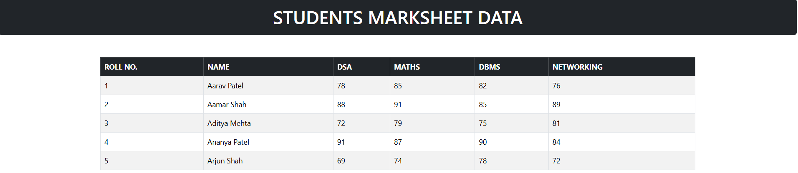

# 🎓 Student Marksheet Data App 
 
A simple and responsive **Student Marksheet Data Application** built using **React.js**, **Bootstrap**, and **JSON Server**. 
 
This project fetches student marksheet data from JSON Server and displays it in a table with **pagination and rows-per-page functionality**. 
 
--- 
 
## 🚀 Technologies Used 
 
* HTML 
* CSS 
* Bootstrap 
* JavaScript 
* React.js 
* JSON Server 
* REST API 
 
--- 
 
## ✨ Features 
 
* Display student marksheet data 
* Fetch data using REST API 
* Student name and roll number 
* DSA, Maths, DBMS and Networking marks 
* Dynamic table rendering 
* Pagination 
* Previous and Next buttons 
* Rows per page selection 
* 5, 50, 75 and 100 rows per page 
* Responsive Bootstrap table 
* React state management 
 
--- 
 
# 🖥️ Project Output / Screenshots 
 
## 🎓 Student Marksheet 
 
The application displays student marksheet data in a Bootstrap table. 
 
 
 
--- 
 
## 📄 Pagination 
 
The pagination section allows users to select rows per page and navigate between student records. 
 
 
 
--- 
 
# 🎥 Video Explanation 
 
In this video, I explain the complete **Student Marksheet Data Project**, including React, JSON Server, API integration, table rendering and pagination. 
 
### ▶️ Video Link 
 
[Watch Project Explanation Video](YOUR_VIDEO_LINK) 
 
--- 
 
# 🔄 Project Workflow 
 
```text 
User 
  ↓ 
React Application 
  ↓ 
useEffect() 
  ↓ 
GET Request 
  ↓ 
JSON Server 
  ↓ 
Student Data 
  ↓ 
React State 
  ↓ 
Pagination 
  ↓ 
Student Marksheet Table add conclusion and good ending to this readme code file

---

# 📌 Conclusion

The **Student Marksheet Data App** is a simple React.js project that demonstrates how to fetch and display student data using a **REST API and JSON Server**.

This project helped me understand **React state management, useEffect(), API integration, dynamic table rendering, and pagination**. It also provides a responsive and user-friendly way to manage and view student marksheet records.

---

# 📚 Learning Outcomes

Through this project, I learned:

- How to work with React.js
- How to fetch data from a REST API
- How to use `useState()` and `useEffect()`
- How to display dynamic data in a table
- How to implement pagination
- How to use JSON Server
- How to create responsive layouts using Bootstrap

---

# 👩‍💻 Developed By

**Aastha**  
Computer Engineering Student  
Full Stack Development Trainee

### 💻 Technologies I Used
**HTML • CSS • Bootstrap • JavaScript • React.js • JSON Server**

---

## ⭐ Thank You for Visiting!

Thank you for checking out my **Student Marksheet Data App**!

This project is part of my learning journey in **Full Stack Development**, where I am continuously improving my skills by building practical projects.

**Keep Learning • Keep Building • Keep Growing 🚀**

---
